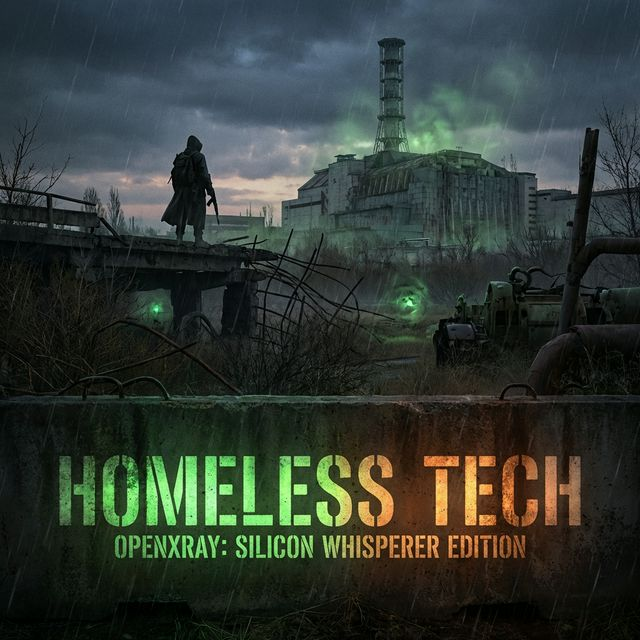

# S.T.A.L.K.E.R. OpenXRay: Ultimate "Homeless Tech" RPi5 Build

Welcome to the **Silicon Whisperer Edition** of OpenXRay, specifically engineered and optimized for the Raspberry Pi 5. This release brings desktop-class S.T.A.L.K.E.R. performance to the ARM64 platform with silicon-level tuning.



---

## 🚀 Key Optimizations

This isn't just a generic compile. We've gone deep into the silicon to squeeze every bit of performance out of the Broadcom BCM2712:

*   **16KB Page Alignment**: Re-linked core engine binaries to support the Pi 5's 16KB-paged kernel natively.
*   **SSE2NEON SIMD Port**: Full translation of x86 SIMD intrinsics to native ARM NEON instructions for maximum throughput.
*   **Real-time Threading**: NPC A-Life thread priority elevated to `SCHED_RR` for fluid world interactions.
*   **Silicon Whisperer Tuner**: Custom scripts to override BIOS/Kernel constraints (`SDRAM_BANKLOW`, `NUMA` interleaving, `IOMMU` policy).
*   **V3D Overrides**: Tuned Mesa V3D driver hints for reduced stutter and improved frame pacing.

---

## 📦 Installation & Uninstallation

To experience the ultimate build, you need to install **both** generated Debian packages. The optimized engine package depends on the data package for branded assets and system-level configuration.

### Installation

1.  **Download the latest release** from the [GitHub Releases](https://github.com/chronic8000/OpenXRay-Pi5/releases) page.
2.  **Install the packages**:
    ```bash
    sudo dpkg -i stalker-pi5-optimized.deb stalker-pi5-data.deb
    sudo apt-get install -f  # To resolve any missing dependencies like numactl
    ```
3.  **Run the Silicon Tuner** (Highly Recommended):
    ```bash
    rpi5_optimize.sh
    ```
    *Note: This will apply silicon-level bandwidth and memory optimizations. A reboot is required for these settings to take effect.*

### Uninstallation

If you need to remove the "Silicon Whisperer" edition from your system:

```bash
sudo apt-get remove --purge stalker-pi5-optimized stalker-pi5-data
sudo apt-get autoremove
```
*Note: This will remove the engine and branded assets. It will not automatically revert the `/boot/firmware/config.txt` changes made by the optimizer script; you should manually review those if you wish to revert to stock RPi5 settings.*

---

## 🎮 Game Assets & Placement

S.T.A.L.K.E.R.: Call of Pripyat assets are required to play. This repository only provides the optimized engine and configuration.

### Required Files
You need the following folders/files from a standard S.T.A.L.K.E.R. Call of Pripyat installation:
*   `gamedata/` (Optional, if you have mods)
*   `levels/`
*   `localization/`
*   `mp/`
*   `resources/`
*   `patches/`
*   All `.db` files (e.g., `configs.db`, `resources.db`, etc.)

### Where to Put Them
After installing the `.deb` packages, place all the listed game assets into the following directory on your Raspberry Pi 5:

```bash
/usr/share/stalker-pi5/
```

*Note: You may need root permissions to copy files here (`sudo cp`). Alternatively, you can point the engine to a custom path using the `-fsltx` flag in the launcher.*

---

## 🚀 Launching the Game

Simply click the **S.T.A.L.K.E.R.** icon in your Games menu, or run it from the terminal via the Silicon Whisperer wrapper:
```bash
stalker-pi5-wrapper
```

---

## 🛠 Build Technicals

*   **Compiler**: GCC 14.2 / G++ 14.2
*   **Architecture**: ARM64 (Cortex-A76 Optimized)
*   **Page Size**: 16KB Native
*   **Memory Allocator**: Standard (malloc) for stability on RPi5 memory architecture.

---

## ❤️ Credits & Support

Brought to you by **Homeless Tech**. 
Check out the building process and support the project on YouTube:
[Homeless Tech YouTube Channel](https://www.youtube.com/@HomelessTechnology)

*Special thanks to the OpenXRay team for the incredible engine foundation.*

---

### Disclaimer
*S.T.A.L.K.E.R.: Call of Pripyat assets are required to play. This repository contains the engine and optimization scripts only.*
